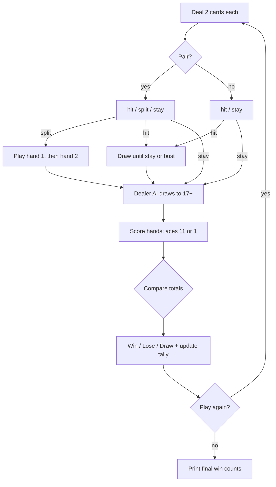

# Blackjack (Python)

A terminal Blackjack game written in Python. You play against a dealer AI with **hit**, **stay**, and **split**, and the game keeps a running tally of wins across rounds.

> One of my first Python projects: game state, card scoring with soft/hard aces, and a simple dealer AI, all with nothing but the standard library.

## Features
- 4-suit deck with face cards and aces (aces count as 11, dropping to 1 automatically to avoid a bust)
- Dealer AI that draws to 17 (and plays more aggressively against a player ace)
- **Split** when your first two cards match, then play each hand separately
- Win tracking for player vs. dealer, with a "play again?" loop

## Sample game
A real session (inputs typed after each `?`):
```text
The dealer shows a 8 with one card face down
Your hand is: [5, 9]
With a total of: 14
would you like to "hit" or "stay"?stay
Dealer busted with:, [8, 2, 3, 10]
You WIN
Another game? "yes" or "no"?yes
The dealer shows a 6 with one card face down
Your hand is: [8, 3]
With a total of: 11
would you like to "hit" or "stay"?hit
You draw a " 5 " with a total of: 16
Would you like to "hit" or "stay"?stay
It was close but in the end you Lose with your hand of: [8, 3, 5] & a total of: 16
The dealer had:  [6, 5, 7] With a total of: 18
You LOSE
Another game? "yes" or "no"?no
The dealer had 1 wins & the player had 1 wins.
```

## How a round works


## Run it
```bash
python Blackjack_Logans.py
```
Requires Python 3, no extra packages.
